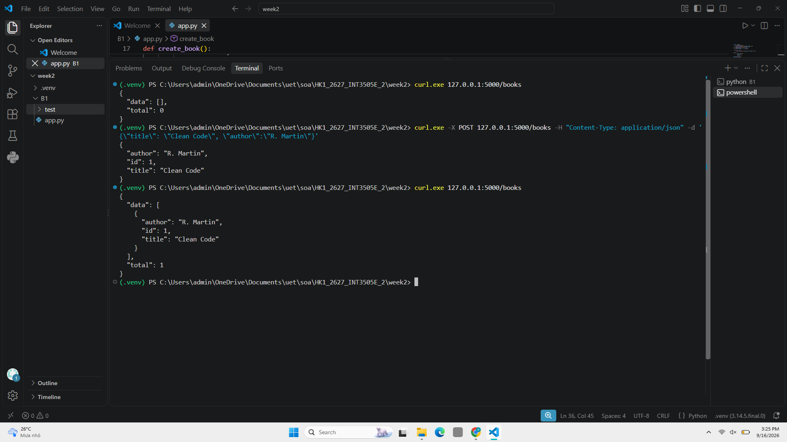
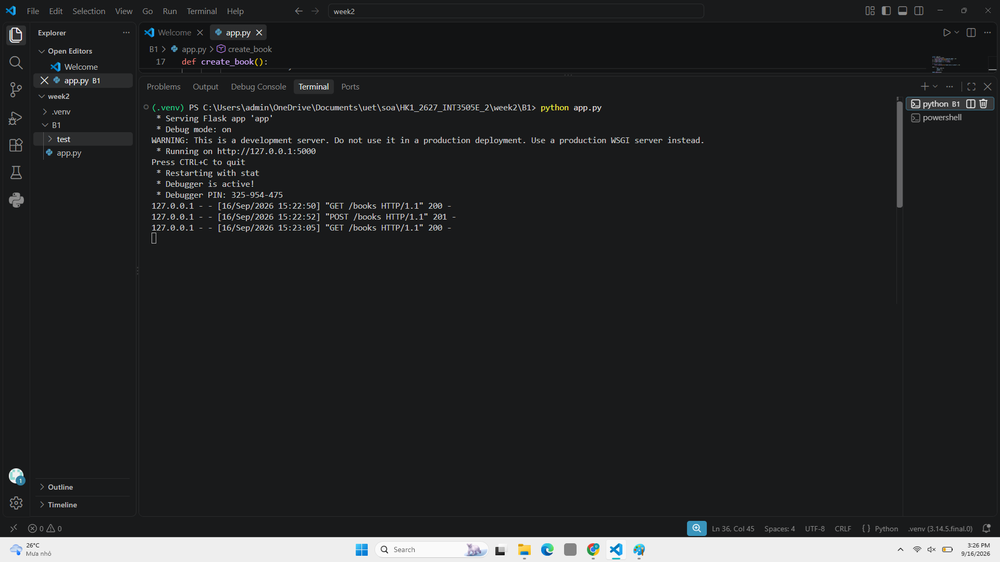
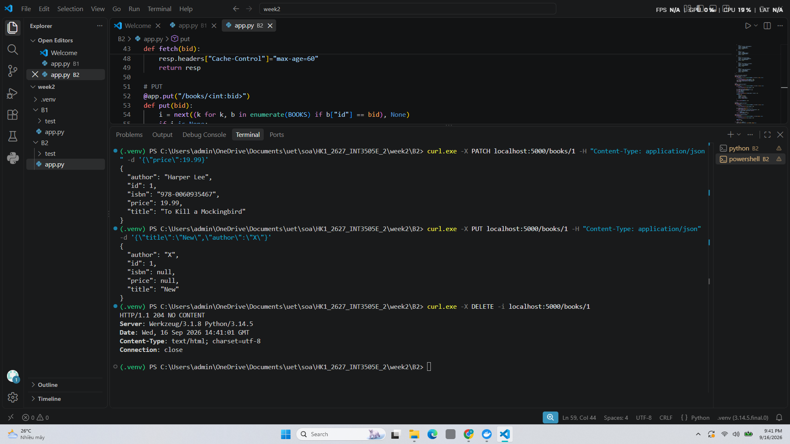
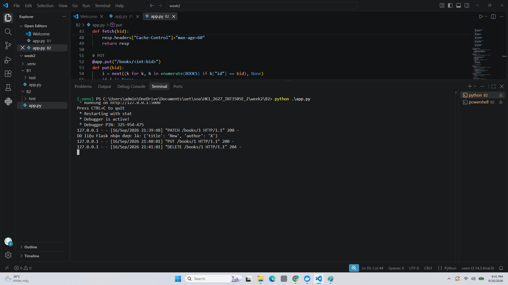
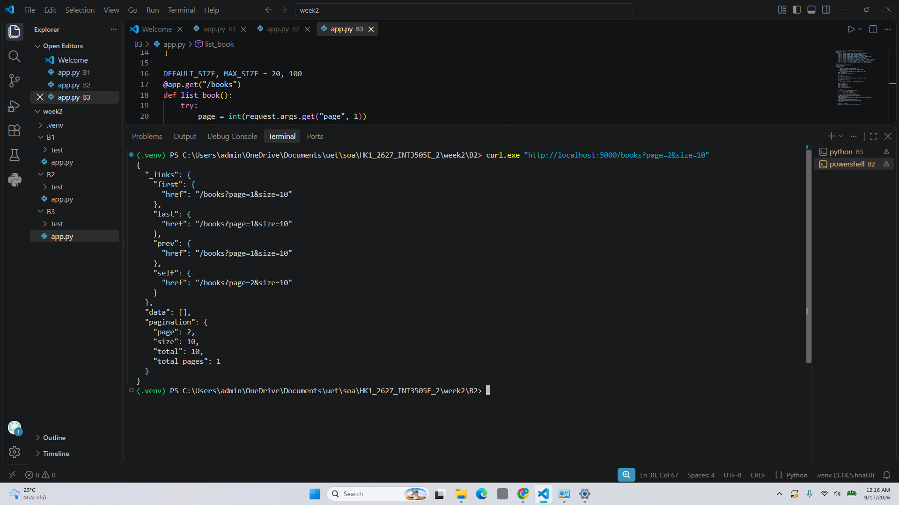
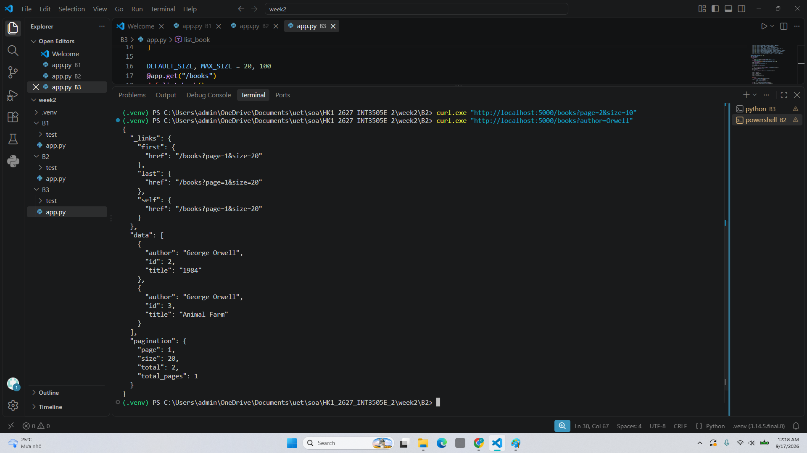
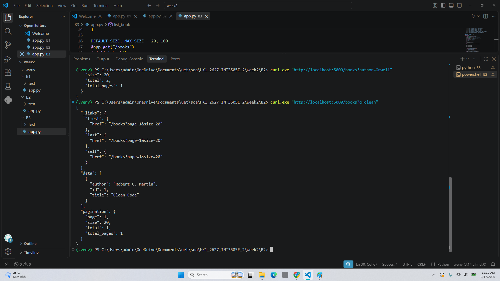
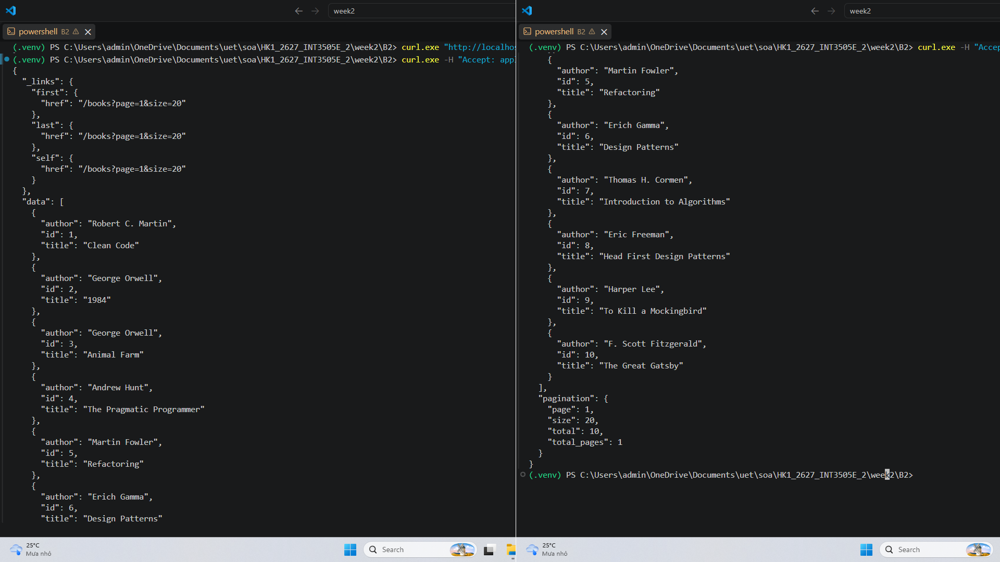
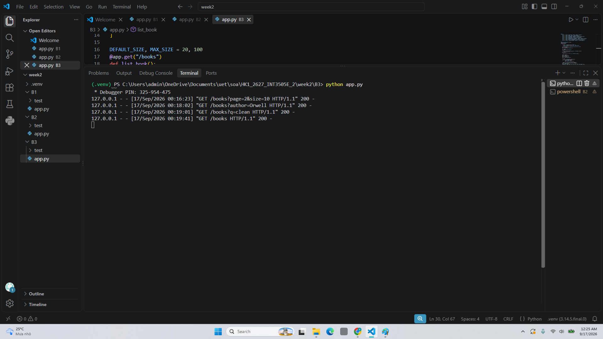

# Tuần 2

## Bài 1 (B1)
### Request
- Lấy list book
- Tạo book mới
- Lấy list book sau tạo

### Server

## Bài 2 (B2)
### Request
Tất cả theo book id
- Đổi price của book
- PUT nhưng chỉ ghi author, title
- Xóa book

### Server

## Bài 3 (B3)
### Test 1: Lấy danh sách book trong trang 2 và mỗi trang có 10 cuốn

### Test 2: Lấy danh sách book lọc theo tác giả

### Test 3: Lấy danh sách lọc theo title

### Test 4: curl.exe -H "Accept: application/json" "http://localhost:5000/books"

### Server

