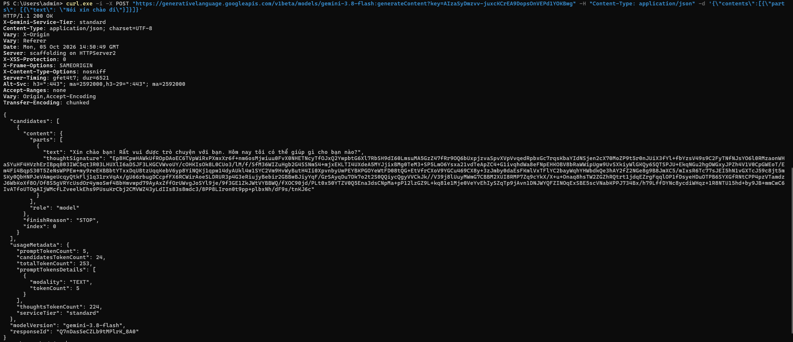
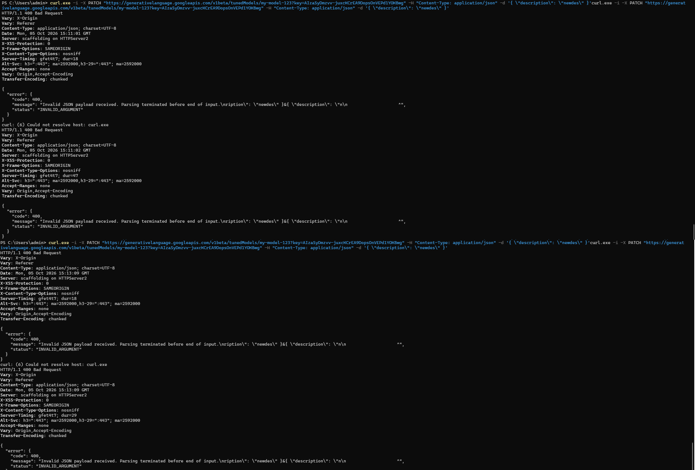
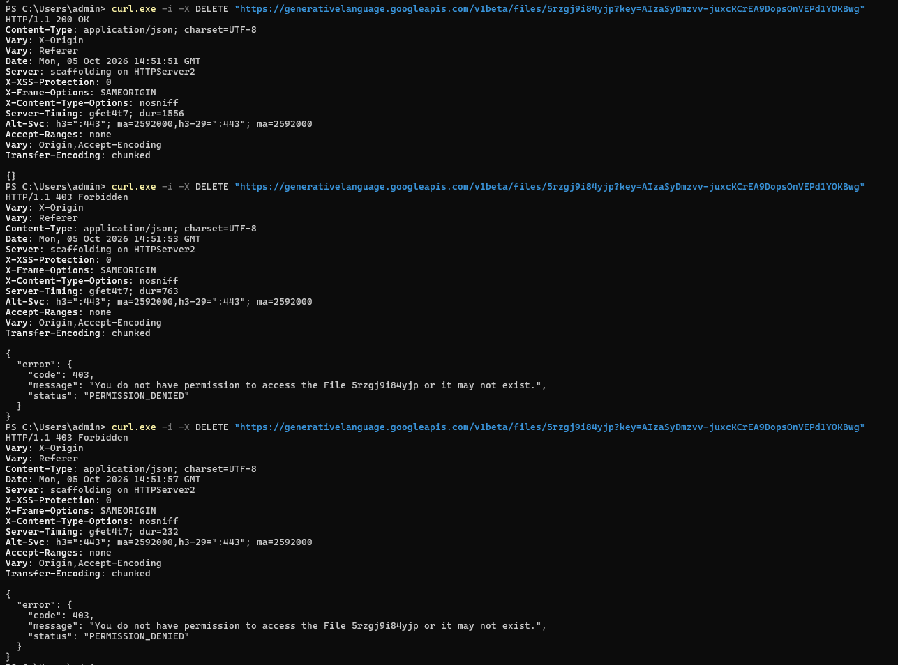
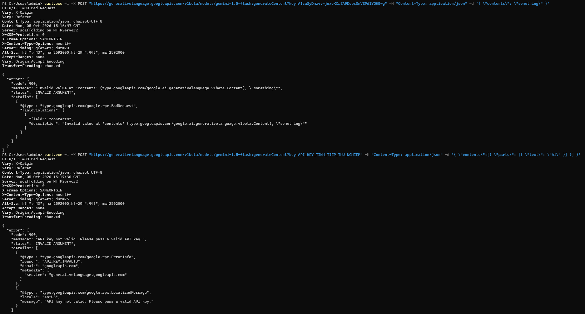

# Checklist review - Nhóm 6
---

API: [Google Gemini API - Deprecations](https://ai.google.dev/gemini-api/docs/deprecations?authuser=8&hl=en)

| Method | Note |
|--------|-------------|
| **POST** | Không thỏa mãn Idempotency, mỗi request POST prompt như nhau đều có thể hỏi lại AI |
| **PATCH** | Thỏa mãn |
| **DELETE** | Thỏa mãn |
| **ERROR** | title -> status   detail -> message   status -> code |

## Tiêu chí 4: Idempotency rõ ràng
---

- **POST:** 200 OK nhưng kết quả khác nhau

- **PATCH:** thỏa mãn Idempotency

- **DELETE:** thỏa mãn Idempotency từ lần gọi thứ 2 trở đi

## Tiêu chí 5: Error response có cấu trúc
---
Hệ thống lỗi của Gemini API không sử dụng chuẩn `application/problem+json` (RFC 7807), nhưng vẫn đảm bảo tính nhất quán và có cấu trúc rành mạch theo chuẩn Google Cloud. Các trường được mapping tương đương như sau:
- Mất trường `type`, thay vào đó dùng mã định danh hệ thống ở trường `status`.
- Trường `detail` (RFC) được thể hiện bằng trường `message`.
- Mã HTTP Status được đưa thẳng vào trường `code` bên trong object JSON.
