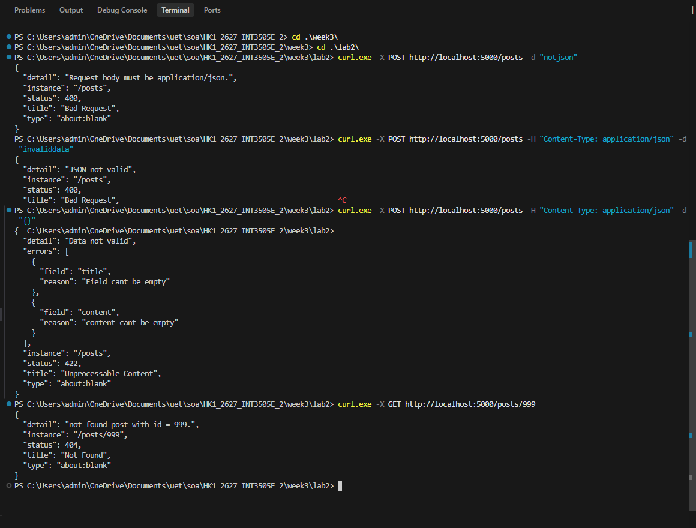
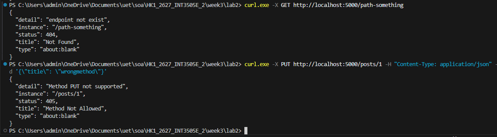
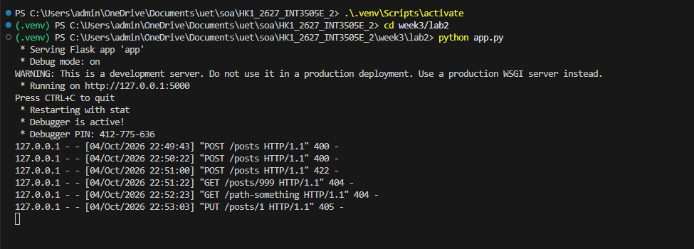

# LAB 2
---
## Tests

### Test 1: Các lỗi Bad Request (400) & Validation (422)

- **400 Bad Request**.
- **422 Unprocessable Content**.

### Test 2: Các lỗi Not Found (404) & Method Not Allowed (405)

- **404 Not Found**.
- **405 Method Not Allowed**.

### Server log

