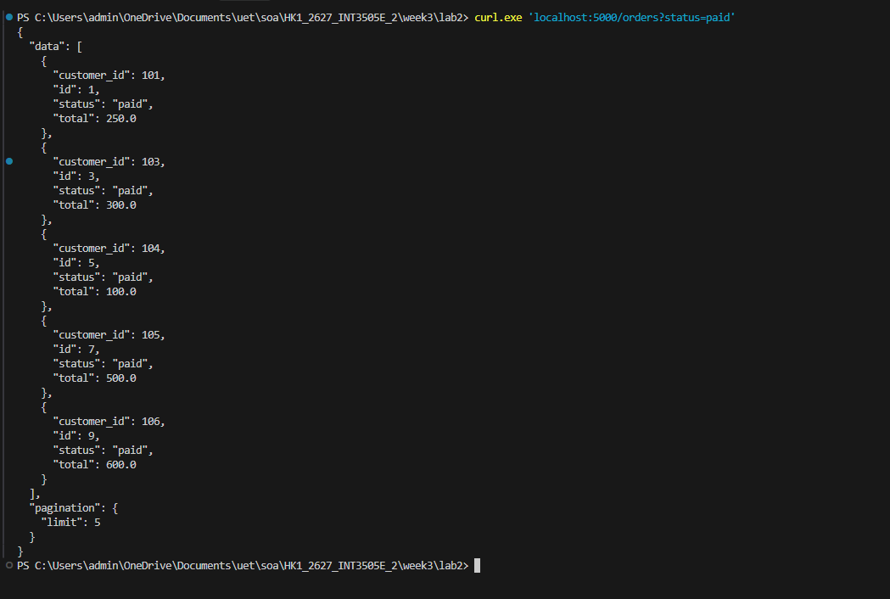
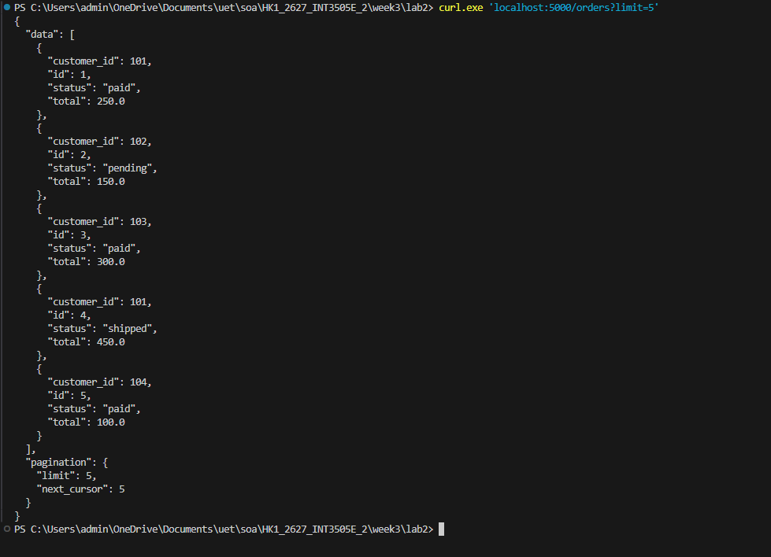
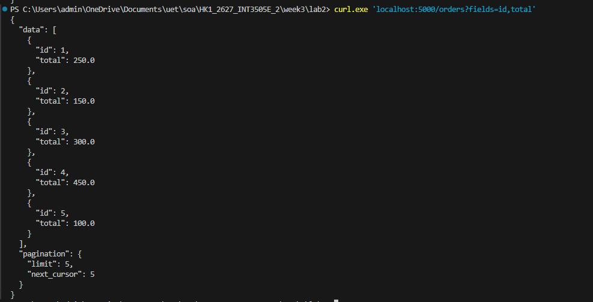
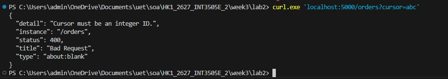

# LAB 3

---

## Tests

### Test 1: Filter
  curl.exe 'localhost:5000/orders?status=paid'

### Test 2: Limit 
  curl.exe 'localhost:5000/orders?limit=5'

### Test 3: Sparse fieldsets
  curl.exe 'localhost:5000/orders?fields=id,total'

### Test 4: Broken cursor (400 Bad Request)
  curl.exe 'localhost:5000/orders?cursor=abc'

